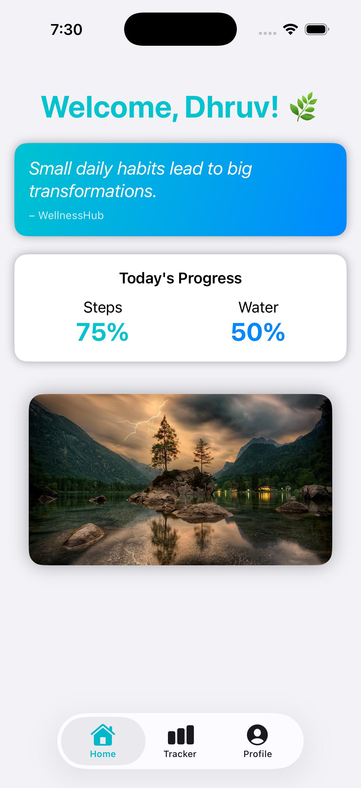

<h1>✨ WellnessHub – Lifestyle Wellness Companion App ✨</h1>

<strong>A multi-tab wellness tracking app built using SwiftUI.</strong> 
  Designed by <a href="mailto:dhruvjivani001@gmail.com">dhruvjivani001@gmail.com</a> 
  GitHub Repo: <a class="btn" href="https://github.com/dhruvjivani/WellnessHub">WellnessHub</a>

<h2 class="feature-title">🌿 Overview</h2>

<strong>WellnessHub</strong> is a multi-tab, visually appealing lifestyle tracking app created using <strong>SwiftUI</strong>. It allows users to:

<ul>
  <li>Track daily habits (water, sleep, mood, exercise)</li>
  <li>View a personalized home dashboard</li>
  <li>Edit and manage their user profile</li>
  <li>Interact with a polished, modern UI using SwiftUI components</li>
</ul>

<h2 class="feature-title">📱 App Features</h2>

<h3 class="feature-title">1️⃣ Home Tab</h3>
<ul>
  <li>Greeting message</li>
  <li>Daily wellness summary</li>
  <li>Motivational quote</li>
  <li>Beautiful nature background image</li>
</ul>

<h3 class="feature-title">2️⃣ Tracker Tab</h3>
<ul>
  <li>Daily input form for:
    <ul>
      <li>Water intake (Slider)</li>
      <li>Sleep hours (Stepper)</li>
      <li>Mood (Picker with emojis)</li>
      <li>Exercise toggle</li>
    </ul>
  </li>
  <li>Validates data input</li>
  <li>Success alert modal</li>
  <li>Automatically resets form</li>
</ul>

<h3 class="feature-title">3️⃣ Profile Tab</h3>
<ul>
  <li>Editable user profile</li>
  <li>Large profile image with gradient header</li>
  <li>Favorite wellness activity</li>
  <li>Smooth animated edit/save mode</li>
  <li>Polished modern UI design</li>
</ul>

<h2 class="feature-title">🎨 UI Screenshots</h2>
<table>
  <tr>
    <td>
      
       <strong>Home Screen</strong>
    </td>
    <td>
      
       <strong>Tracker</strong>
    </td>
    <td>
      
       <strong>Profile</strong>
    </td>
  </tr>
</table>

<h2 class="feature-title">🧱 Project Structure</h2>
<pre>
  WellnessHub/
  │
  ├── WellnessHubApp.swift
  ├── ContentView.swift
  │
  ├── Tabs/
  │   ├── HomeView.swift
  │   ├── TrackerView.swift
  │   ├── ProfileView.swift
  │
  ├── Components/
  │   ├── QuoteCard.swift
  │   ├── SummaryCard.swift
  │
  ├── Models/
  │   ├── UserModel.swift
  │
  └── Assets.xcassets/
      ├── profile_pic.png
      ├── nature_bg.jpg
</pre>

<h2 class="feature-title">🧑‍💻 Author</h2>

Dhruv Jivani 
  📧 Email: <a href="mailto:dhruvjivani001@gmail.com">dhruvjivani001@gmail.com</a> 
  🌐 GitHub Repo: <a href="https://github.com/dhruvjivani/WellnessHub">WellnessHub</a>

<h2 class="feature-title">📄 License</h2>

This project is open-source. Feel free to modify and expand!

<h2 class="feature-title">✅ Want me to add?</h2>
<ul>
  <li>⭐ Custom banner/logo</li>
  <li>⭐ Light/Dark mode images</li>
  <li>⭐ App icon design</li>
  <li>⭐ More advanced CSS-styled sections</li>
</ul>

Just tell me — I can enhance the README even further!

